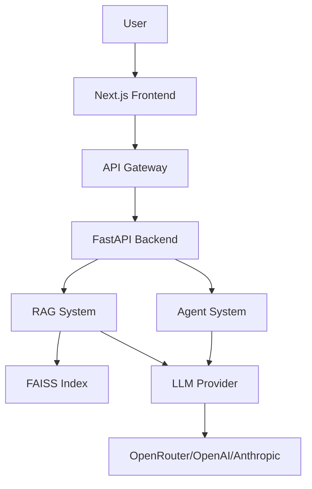

# AI/ML Portfolio 🤖

> Production-ready AI/ML portfolio showcasing Large Language Models, Retrieval-Augmented Generation, and intelligent agents. All demos are reproducible and deployable.

[](https://github.com/YOUR_USERNAME/ai-portfolio/actions)
[](https://opensource.org/licenses/MIT)
[](https://colab.research.google.com/github/YOUR_USERNAME/ai-portfolio/blob/main/notebooks/reproduce_demo.ipynb)

## ✨ Features

- **🤖 LLM Integration**: Multi-provider support (OpenRouter, OpenAI, Anthropic)
- **📚 RAG System**: Semantic search with FAISS + LLM generation
- **🎯 AI Agents**: Multi-step reasoning with safe, sandboxed execution
- **💬 Interactive Demos**: Chat interface and agent playground
- **📊 Reproducible**: Jupyter notebooks and precomputed embeddings
- **🚀 Deployable**: Docker, Vercel, and GitHub Pages ready

## 🎬 Quick Start

### Local Development

```bash
# Clone repository
git clone https://github.com/YOUR_USERNAME/ai-portfolio
cd ai-portfolio

# Install dependencies
npm install
cd frontend && npm install
cd ../backend && pip install -r requirements.txt

# Configure environment (optional - works offline without API keys)
cp .env.example .env
# Edit .env and add your OPENROUTER_API_KEY

# Generate embeddings
cd backend
python ../scripts/generate_embeddings.py

# Run development servers
cd ..
npm run dev
```

Visit **http://localhost:3000** to see the portfolio!

### Docker

```bash
# Build and run with Docker Compose
docker-compose up --build

# Visit http://localhost:3000
```

### Try the Notebook

[](https://colab.research.google.com/github/YOUR_USERNAME/ai-portfolio/blob/main/notebooks/reproduce_demo.ipynb)

Click the badge to run the RAG demo in Google Colab (no setup required!)

## 📁 Project Structure

```
ai-portfolio/
├── frontend/                # Next.js frontend
│   ├── pages/              # Pages (index, projects, chat, agent)
│   ├── components/         # React components
│   └── styles/             # Tailwind CSS
├── backend/                # FastAPI backend
│   ├── main.py            # API endpoints
│   ├── rag.py             # RAG system
│   └── agent.py           # Agent implementation
├── content/                # Project markdown files
│   └── projects/          # Sample projects
├── data/                   # Sample data and embeddings
│   ├── sample/            # CSV dataset
│   └── sample_embeddings/ # FAISS index
├── notebooks/              # Jupyter notebooks
├── tests/                  # Pytest tests
├── scripts/                # Utility scripts
└── .github/workflows/      # CI/CD
```

## 🚀 Deployment

### Vercel (Recommended)

```bash
# Install Vercel CLI
npm i -g vercel

# Deploy
vercel --prod

# Set environment variables in Vercel dashboard:
# - OPENROUTER_API_KEY
# - LLM_PROVIDER=openrouter
```

### GitHub Pages (Static Export)

```bash
# Export static site
bash scripts/export_demo.sh

# Deploy to GitHub Pages
# (Follow GitHub Pages setup instructions)
```

### Docker Production

```bash
# Build production images
docker-compose -f docker-compose.prod.yml up --build
```

## 🏗️ Architecture



### Technology Stack

**Frontend**
- Next.js 14 (React 18)
- TypeScript
- Tailwind CSS
- React Markdown with Mermaid support

**Backend**
- FastAPI (Python 3.11+)
- Sentence Transformers
- FAISS (vector search)
- OpenRouter/OpenAI SDK

**Infrastructure**
- Docker & Docker Compose
- GitHub Actions (CI/CD)
- Vercel (deployment)

## 📖 Projects

### 1. LLM-Powered Chatbot
Multi-provider chatbot with context management and streaming responses.

**Tech**: OpenRouter, FastAPI, React
**Demo**: [/chat](/chat)

### 2. RAG System for Document Q&A
Semantic search + LLM generation with source attribution.

**Tech**: FAISS, Sentence Transformers, LLMs
**Demo**: [/chat](/chat)

### 3. Multi-Step AI Agent
Autonomous agent with task decomposition and safe execution.

**Tech**: FastAPI, React, Sandboxed execution
**Demo**: [/agent](/agent)

## 🧪 Testing

```bash
# Run all tests
npm test

# Backend tests only
cd backend
pytest tests/ -v

# Frontend type-checking
cd frontend
npm run type-check

# Linting
npm run lint
```

## 🔧 Configuration

### Environment Variables

```bash
# LLM Provider (openrouter, openai, anthropic, mock)
LLM_PROVIDER=openrouter

# OpenRouter (Recommended)
OPENROUTER_API_KEY=sk-or-v1-...
OPENROUTER_MODEL=anthropic/claude-3.5-sonnet

# Alternative: OpenAI
# OPENAI_API_KEY=sk-...
# OPENAI_MODEL=gpt-4-turbo

# Agent Safety
AGENT_ENABLED=false  # Set to true to enable agent playground

# Ports
BACKEND_PORT=8000
FRONTEND_PORT=3000
```

### Offline Mode

The portfolio works **offline** without API keys using:
- Precomputed embeddings
- Mock LLM responses
- Sample dataset

Perfect for demos and development!

## 📊 Performance

| Metric | Value |
|--------|-------|
| RAG Query Latency | ~300ms |
| Embedding Dimension | 384 |
| Index Size (15 docs) | ~10KB |
| Frontend Bundle | ~200KB (gzipped) |

## 🤝 Contributing

Contributions welcome! Please:
1. Fork the repository
2. Create a feature branch
3. Make your changes
4. Add tests
5. Submit a pull request

## 📝 License

MIT License - see [LICENSE](LICENSE) for details.

## 🔒 Security

See [SECURITY.md](SECURITY.md) for security policy and responsible disclosure.

## 👤 About Me

<!-- TODO: Add your bio here -->

I'm a full-stack ML engineer passionate about building production-ready AI systems. This portfolio showcases my work with LLMs, RAG, and autonomous agents.

**Skills**: Python, TypeScript, React, FastAPI, LLMs, RAG, Vector Databases

**Connect**:
- GitHub: [YOUR_USERNAME](https://github.com/YOUR_USERNAME)
- LinkedIn: [YOUR_PROFILE](https://linkedin.com/in/YOUR_PROFILE)
- Email: your.email@example.com

## 🙏 Acknowledgments

- [OpenRouter](https://openrouter.ai/) for multi-provider LLM access
- [FAISS](https://github.com/facebookresearch/faiss) for efficient vector search
- [Sentence Transformers](https://www.sbert.net/) for embeddings
- [Next.js](https://nextjs.org/) and [FastAPI](https://fastapi.tiangolo.com/) teams

---

**⭐ Star this repo if you find it helpful!**
